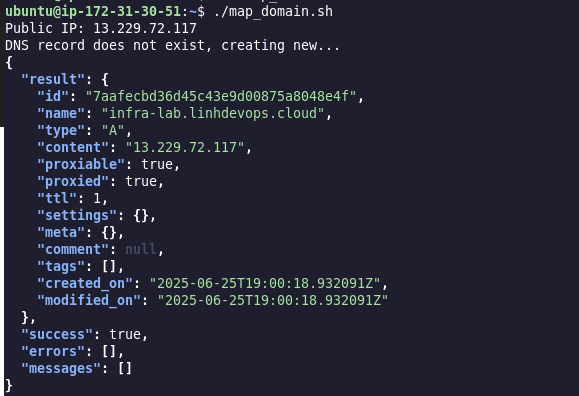

# Infrastructure Lab

## Overview

Design and deploy a simple web application on AWS. This task aims to evaluate your skills in infrastructure setup, documentation, and automation.

## Architecture


- **EC2**: Deploy an EC2 instance to host the web application.
- **ECR**: Store and manage container images.
- **S3**: Create an S3 bucket for storing static files or application backups.
- **IAM**: Configure necessary IAM roles and policies for secure access.
- **Security Groups**: Set up security groups to allow HTTP/HTTPS traffic to EC2.
- **Terraform**: Write Terraform scripts to automate infrastructure setup.
- **Source code**: The source code used for demonstrating the CI/CD pipeline is referenced from the repository at https://github.com/nhutlin/portfolio-website.git.

## Requirements

- **AWS Account**: The AWS Account to create infrastructure and deploy website.
- **IAM user**: The IAM user's credential which have permission to create S3, EC2, ECR, IAM.
- **Terraform command line**: To run terraform command to apply resources.

## Before setup

1. Create ssh key to access EC2.

```sh
cd ~
ssh-keygen -t ed25519
```

2. Add Access Key and Secret Key to credential with aws cli at **~/.aws/credentials**

```sh
[default]
aws_access_key_id = 
aws_secret_access_key = 
```

3. Clone this project

```sh
git clone https://github.com/nhutlin/infra-lab.git
```

4. This repository was created at the first time by using Terraform at folder **github-repo**. Step by step:
    
Create GitHub Token and add to github-repo/terraform.tfvars

```sh
github_token     = ""
github_owner     = "nhutlin"
repository_name  = "infra-lab"
visibility       = "public"
```

Apply by Terraform

```sh
cd github-repo
terraform init
terraform plan
terraform apply
```

## Detail configuration

### Terraform structure

```sh
── infra-lab-web
│   ├── files
│   │   ├── install-github-runner.sh
│   │   ├── map_domain.sh
│   │   ├── sync-to-s3.sh
│   │   └── user_data.sh
│   ├── main.tf
│   ├── outputs.tf
│   ├── terraform.tfvars
│   └── variables.tf
├── modules
│   ├── ec2
│   │   ├── main.tf
│   │   ├── outputs.tf
│   │   └── variables.tf
│   ├── iam
│   │   ├── main.tf
│   │   ├── outputs.tf
│   │   └── variables.tf
│   └── s3
│       ├── main.tf
│       ├── outputs.tf
│       └── variables.tf
```

- **Main terraform**: Create a EC2, VPC, SG, IAM, S3 from modules and expose the IP public, Bucket name to the console.
- **Module ec2**: Module that create Security Group, VPC, EC2.
- **Module iam**: Module that create IAM role and S3 Policy.
- **Module s3**: Module that create S3.
- **Script files**: Create GitHub runner, map domain, sync file to S3 automatically.
- **User data**: Auto install Docker, Nginx, Certbot, aws cli.

### Run terraform command to create resource

Using terraform command line

```sh
cd infra-lab-web
terraform init
terraform plan
terraform apply
```
Wait about 30 seconds, the console will expose the output like:

```sh
Outputs:

ec2_public_ip = "13.229.72.117"
iam_instance_profile = "infra-lab-role-profile"
s3_bucket_name = "infra-lab-bucket-xxxxxxxx"
```

### Add environment variable, Token to the script files

Save the s3_bucket_name and paste to the **BUCKET** variable in **files/sync-to-s3.sh**

```sh
#!/bin/bash


EXPORT_DIR="/home/ubuntu/export"
BUCKET="infra-lab-bucket-xxxxxxxx"
REGION="ap-southeast-1"


LOG_FILE="/home/ubuntu/s3_sync.log"


echo "[$(date '+%Y-%m-%d %H:%M:%S')] Starting sync S3..." >> "$LOG_FILE"


aws s3 sync "$EXPORT_DIR" "s3://$BUCKET" --delete --region "$REGION" >> "$LOG_FILE" 2>&1

echo "[$(date '+%Y-%m-%d %H:%M:%S')] Done." >> "$LOG_FILE"
echo "---------------------------------------------" >> "$LOG_FILE"
```

Add Cloudflare Token and Zone ID the **CLOUDFLARE_API_TOKEN** and **ZONE_ID** variable in **files/map_domain.sh**

```sh
#!/bin/bash

set -e
CLOUDFLARE_API_TOKEN="EXAMPLE_TOKEN"
ZONE_ID="EXAMPLE_ZONE_ID"
RECORD_NAME="infra-lab.linhdevops.cloud"

EIP=$(curl -s ifconfig.me)

if [ -z "$EIP" ]; then
  echo "Public IP not found. Exiting."
  exit 1
fi

echo "Public IP: $EIP"

# === Find ID of DNS recently record ===
RECORD_ID=$(curl -s -X GET "https://api.cloudflare.com/client/v4/zones/${ZONE_ID}/dns_records?type=CNAME&name=${RECORD_NAME}" \
     -H "Authorization: Bearer ${CLOUDFLARE_API_TOKEN}" \
     -H "Content-Type: application/json" | jq -r '.result[0].id')

if [ "$RECORD_ID" != "null" ]; then
  echo "Updating DNS record..."
  curl -s -X PUT "https://api.cloudflare.com/client/v4/zones/${ZONE_ID}/dns_records/${RECORD_ID}" \
       -H "Authorization: Bearer ${CLOUDFLARE_API_TOKEN}" \
       -H "Content-Type: application/json" \
       --data '{"type":"CNAME","name":"'"${RECORD_NAME}"'","content":"'"${EIP}"'","ttl":1,"proxied":true}' | jq
else
  echo "DNS record does not exist, creating new..."
  curl -s -X POST "https://api.cloudflare.com/client/v4/zones/${ZONE_ID}/dns_records" \
       -H "Authorization: Bearer ${CLOUDFLARE_API_TOKEN}" \
       -H "Content-Type: application/json" \
       --data '{"type":"CNAME","name":"'"${RECORD_NAME}"'","content":"'"${EIP}"'","ttl":1,"proxied":true}' | jq
fi

sudo snap install --classic certbot
sudo ln -s /snap/bin/certbot /usr/bin/certbot
```
Access to GitHub repository: https://github.com/nhutlin/portfolio-website.git and create Generate Token GitHub Runner and import to **files/install-github-runner.sh**

```sh
#!/bin/bash

mkdir actions-runner && cd actions-runner
curl -o actions-runner-linux-x64-2.325.0.tar.gz -L https://github.com/actions/runner/releases/download/v2.325.0/actions-runner-linux-x64-2.325.0.tar.gz
tar xzf ./actions-runner-linux-x64-2.325.0.tar.gz
./config.sh --url https://github.com/nhutlin/portfolio-website --token EXAMPLE_TOKEN
sudo ./svc.sh install
sudo ./svc.sh start
```

### Copy and run script files to EC2 

Copy script files by using scp command

```sh
cd infra-lab-web/files
scp install-github-runner.sh map_domain.sh sync-to-s3.sh ubuntu@13.229.72.117:/home/ubuntu
```

SSH to EC2 and run script

```sh
ssh ubuntu@13.229.72.117
sudo chmod +x install-github-runner.sh map_domain.sh sync-to-s3.sh
./install-github-runner.sh
./map_domain.sh
```

Output: 





### Run pipeline to deploy website on EC2 by docker compose

Access to GitHub repository: https://github.com/nhutlin/portfolio-website.git and run pipeline GitHub Actions


Workflow:

```sh
name: CI/CD to ECR and Deploy

on:
  push:
    branches:
      - main

jobs:
  build-and-push:
    name: Build Docker image and push to ECR
    runs-on: ubuntu-latest

    outputs:
      image_tag: ${{ steps.set-tag.outputs.tag }}

    steps:
      - name: Checkout code
        uses: actions/checkout@v4

      - name: Set image tag
        id: set-tag
        run: echo "tag=latest" >> "$GITHUB_OUTPUT"

      - name: Configure AWS credentials
        uses: aws-actions/configure-aws-credentials@v4
        with:
          aws-access-key-id: ${{ secrets.AWS_ACCESS_KEY_ID }}
          aws-secret-access-key: ${{ secrets.AWS_SECRET_ACCESS_KEY }}
          aws-region: ${{ secrets.AWS_REGION }}

      - name: Login to Amazon ECR
        uses: aws-actions/amazon-ecr-login@v2

      - name: Build, tag, and push image
        env:
          ECR_REGISTRY: ${{ secrets.ECR_REGISTRY }}
          ECR_REPOSITORY: ${{ secrets.ECR_REPOSITORY }}
          IMAGE_TAG: latest
        run: |
          docker build -t $ECR_REPOSITORY:$IMAGE_TAG .
          docker tag $ECR_REPOSITORY:$IMAGE_TAG $ECR_REGISTRY/$ECR_REPOSITORY:$IMAGE_TAG
          docker push $ECR_REGISTRY/$ECR_REPOSITORY:$IMAGE_TAG

  deploy:
    needs: build-and-push     
    name: Pull image from ECR & deploy with Docker Compose
    runs-on: [self-hosted, linux]

    steps:
      - name: Checkout repo
        uses: actions/checkout@v4

      - name: Configure AWS credentials
        uses: aws-actions/configure-aws-credentials@v4
        with:
          aws-access-key-id: ${{ secrets.AWS_ACCESS_KEY_ID }}
          aws-secret-access-key: ${{ secrets.AWS_SECRET_ACCESS_KEY }}
          aws-region: ${{ secrets.AWS_REGION }}

      - name: Login to Amazon ECR as root
        run: |
          aws ecr get-login-password --region ${{ secrets.AWS_REGION }} | sudo docker login --username AWS --password-stdin ${{ secrets.ECR_REGISTRY }}


      - name: Pull image and start service
        run: |
          sudo docker compose down || true
          sudo docker system prune -af
          sudo docker compose up -d

      - name: Show running containers
        run: sudo docker ps
```

Check Docker status


Run certbot command to create certificate for domain

```sh
sudo certbot --nginx
```
Output:


Access to domain: https://infra-lab.linhdevops.cloud


Using nslookup to check IP of domain


### Backup website's files to S3

Using cronjob to backup files everyday at 1 a.m. UTC +0

```sh
crontab -e
```
Paste path of script ***sync-to-s3.sh*** to cron

```sh
0 18 * * * /home/ubuntu/sync-to-s3.sh # UTC +7
```

## Clean Up AWS resources

At the root path of project, using terraform command the clean up resources on AWS

```sh
cd infra-lab-web
terraform destroy
```

## The feature will be developed in the future

- Using terraform workspace for each environment
- Deploy on AWS EKS with Argo CD
- Create RDS by terraform and backup dump files on S3
- Add monitor tools like Prometheus, Grafana, Loki...


